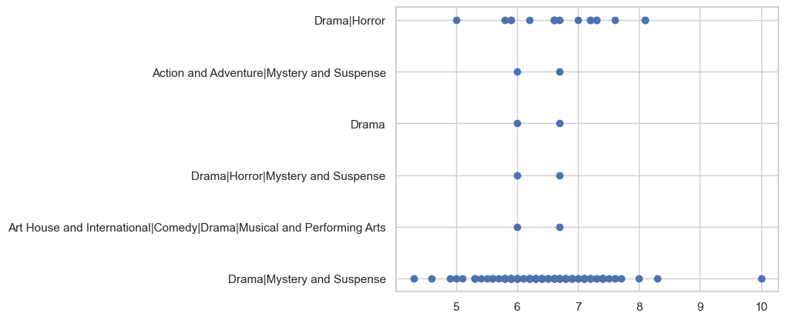
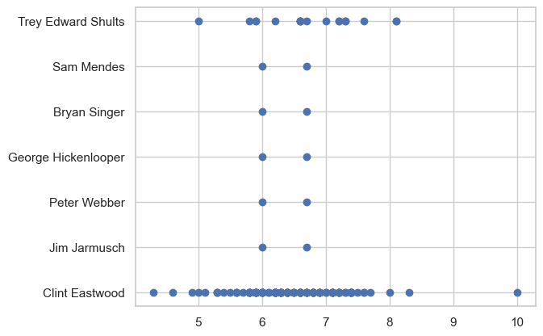
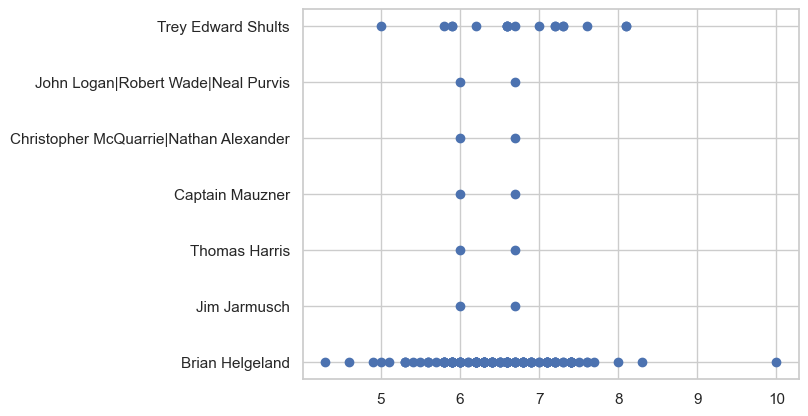
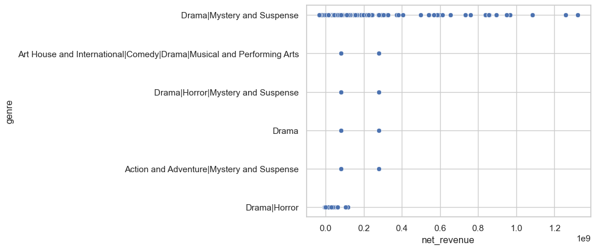
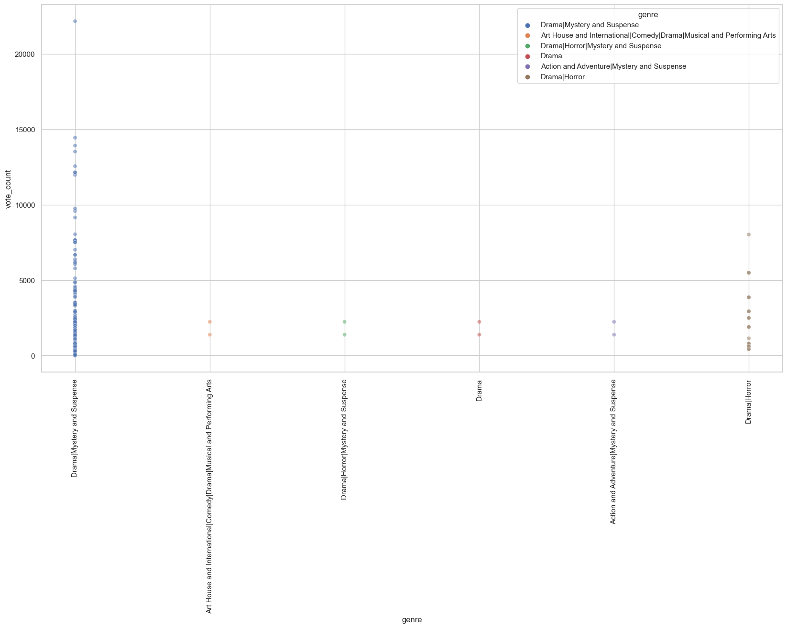

# MOVIE PRODUCTION ANALYSIS.

## OVERVIEW

Top talent studios wants to start a new businness venture of creating original video content specifically movies, but do not know much about the industry. 
The project analyzes data from various locations; IMDB,TheMovieDB, BoxOfficeMojo etc. to come up with insights on which types of films are currently doing best at the box office.
    
The findings from the project will help the company choose what type of films to produce based on production budgets and revenues, bestselling genres, trends in movie genres and production styles and top performing writers and directors in the industry.

     
## BUSINESS PROBLEM

In response to the growing trend of major companies producing original video content, your company has decided to launch its own movie studio. 

However, with limited experience in the film industry, the team lacks insights into what drives box office success. 
The project analyzes current box office performance data to identify the types of films that perform best.

The goal is to translate the findings into clear, data-driven recommendations that will guide the new studio in choosing the most promising film genres, formats, or themes to invest in.

###### Objectives:

1. Identify the movie genres that generate the highest profitability relative to production budgets.

2. Determine which genres achieve the highest average audience ratings.

3. Analyze current and emerging trends in movie genres, themes, and production styles.

4. Identify top-performing writers, directors, and producers for potential collaboration based on proven success metrics.

## DATA UNDERSTANDING

In the data folder, we have datasets from various locations; IMDB,TheMovieDB, BoxOfficeMojo etc. to come up with insights on which types of films are currently doing best at the box office.

The data contains all the information we need: genres, movie titles, writers and producers, release dates, production budgets and revenues created in the box office that we'll use to answer our business questions.

### DATA ANALYSIS.

###### Exploratory data analysis
Plotted current and emerging trends in genres.
Plotted a scatter plot to show:
a. audience ratings on the different genres, to show the one that receives most ratings.
Drama|Horror and Drama|Mystery|Suspense are suitable genres for the studio due to the high ratings.

b. top performing writers and directors in the industry, for us to work with.

Trey Edward Shults and Clint Eastwood are possible directors to work with the studio.

Trey Edward SHults and Brian Helgeland should be hired into the studio as writers.

c. genre that generates most revenues for the studios.

###### Hypothesis testing and statistical tests 
Formulated two hypotheses;
1. Identify the movie genres that generate the highest profitability relative to production budgets.

2. Determine which genres achieve the highest average audience ratings.

###### Regression modelling.
Built and explained linear regression model inference: Does Production Budget Significantly Influence Revenue?

# RESULTS

### Hypothesis testing.

###### Profitability vs Production budget 

**Null** - There is NO significant difference in profitability relative to production budget across movie genres

**ALT** - There is a significant difference in profitability relative to production budget across movie genre 

Based on our results our p value is greater than 0.05, therefore, we have failed to reject our null hypothesis meaning that there is no significant difference in profitability across the movie genres.

######  Average audience rating 
**Null** - Average audience rating does not differ by genre

**Alt** - Average audience rating differs by genre

Our results show that we have failed to reject the null hypothesis meaning audience rating does not differ by genre.

Our hypotheses questions both failed to reject the null hypothesis.

- We learn that genre doesn't really have an effect on audience rating nor does it have an efftect on profit.

- Despite this there are several movies that fall in the Drama, Mystery and Suspense Genre. This tells us that we can create movies that fall in any of these genres. 

- From this we learned that we might have to do some deeper data cleaning so as to get better results e.g splitting up the genres based on primary genre

### Regression modelling.

Observation: The regression plot shows a positive linear relationship between production budget and worldwide gross revenue.
The scatter suggests variability increases with budget, meaning high-budget films have less predictable returns.

Residuals are roughly centered around zero, which supports the linearity assumption.
Some spread increases at higher fitted values, indicating possible heteroscedasticity (variance of the residuals is not constant).
This suggests the model performs better at lower budget levels and less consistently at higher levels.

There is a statistically significant and positive relationship between a film’s production budget and its worldwide gross revenue. 
Higher production budgets generally lead to higher expected revenues.

However, since budget explains only about 57% of revenue variability, other factors like genre, marketing, and release timing also play critical roles.
Strategic investment in production budgets, combined with strong genre and release strategies, will maximize profitability.

# CONCLUSIONS

The analysis yielded three business recommendations:

### Production budgets significantly influence revenue on a moderate scale.

The model's results showed that higher production budgets led to higher revenues, since budget explained only about 57% of revenue variability, other factors like genre, marketing, and release timing also play critical roles.
The new studio should therefore balance its finances to cater for marketing strategies and release timing that will boost its revenues.

### Drama, Mystery and Suspense Genre performs best in terms of profit and ratings.

Although genre does not really affect audience ratings or profit, drama,mystery and suspense genre showed to have the highest ratings and profit generation compared to the other genres. 

### Trey Edward Shults, Clint Eastwood and Brian Helgeland are the possible writers and directors to work with.
From the results obtained, they show the highest average ratings on films they made and would make a good fit for the studios to work with.

# NEXT STEPS

Further analyses could yield better insights to better influence company's decision for choice of movies to produce:

### Explore relationship of revenues generated with movie  release dates.

Analysis of how timing of a movie's release dates affect how much profit it generates. This involves identifying patterns, trends, or correlations between:
Release dates: When a movie was released (e.g., month, season, weekday, holiday)

Revenue: How much money the movie earned (e.g., domestic, international, opening weekend, total gross)

By analyzing this, the studio could decide; when to release high-budget films, when to avoid crowded release windows, whether seasonality impacts certain genres differently.

### Show movie popularity based on movie runtime.

Analyzing how the length of a movie (its runtime in minutes) might influence or correlate with how popular that movie is among audiences. This can help the movie studio decide on ideal runtimes for maximizing engagement or ticket sales.

### Analyze film performance based on its language or region.

Analysis of how well a movie performs based on its language or region gives critical insights into audience preferences, market trends, and cultural factors. This kind of analysis is especially useful for studios that want to:
Target the right audience

Choose distribution strategies

Plan dubbing or subtitling investments

Identify high-performing regional markets

