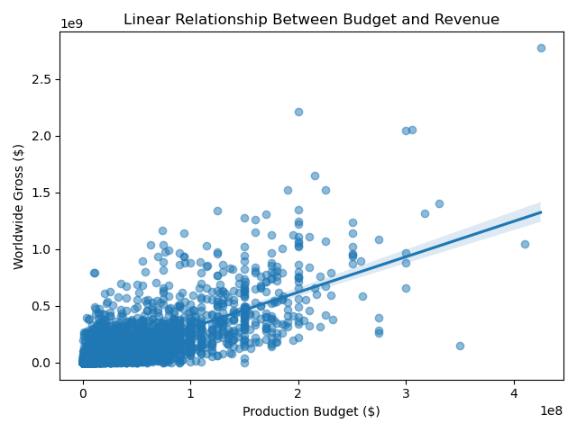

# movie-analysis-project
Group 2 project to analyze movies and recommend high-performing genres for a new studio.

# 🎯 Linear Regression Model: Production Budget vs Worldwide Gross

## 📊 Analysis Performed

- **Data Source:** `tn.movie_budgets.csv`
- **Columns used:** 
  - `production_budget`
  - `worldwide_gross`
- Simple Linear Regression using **statsmodels.OLS**
- Residual analysis to validate assumptions

## 📌 Key Findings

- A **statistically significant** positive correlation exists between budget and revenue.
- On average, for every $1 million increase in production budget, expected revenue increases by **approximately $2.73 million**.
- **R² ≈ 0.57**: Budget explains ~57% of the variation in revenue.
- **Heteroscedasticity** observed in residuals — model performs better at lower budget levels
.
## ✅ Conclusion
Production budget is a strong predictor of box office revenue, but not the sole factor. This model helps guide investment decisions but should be used alongside other variables like genre, marketing, and release timing for more accurate forecasting.